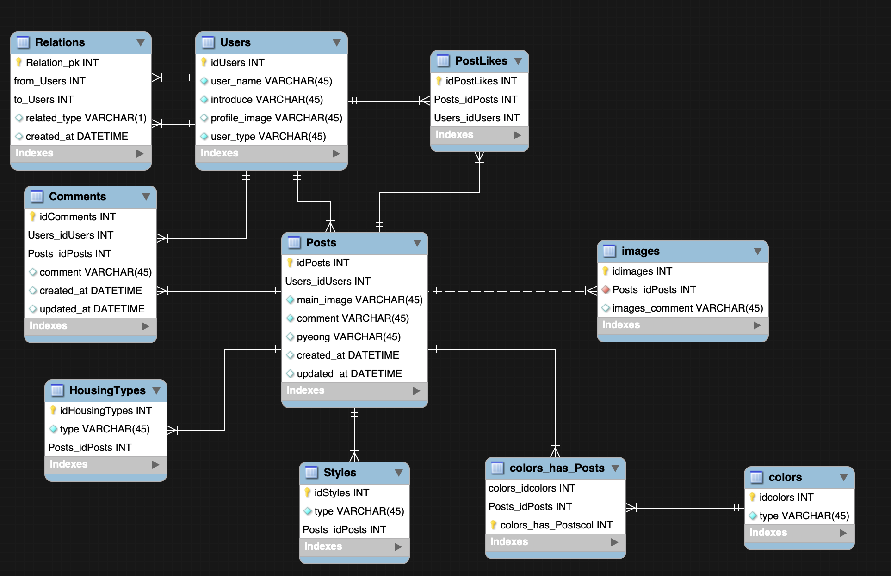

# igloo
<hr>

## Installation
### Requirements

Python, packages

- python 3.6.6
``` pip install -r requirements.txt```

Secrets

```.secrets/base.json```

```python
{
  "SECRET_KEY": "<django secret key>",
  "FACEBOOK_APP_ID":<Facebook app id>,
  "FACEBOOK_APP_SECRET":"<Facebook app password>"
}
```

```
# .secrets/dev.json & productions.json
{
  "DATABASES": {
    "default": {
      "ENGINE": "django.db.backends.postgresql",
      "HOST": "<rds endpoint>",
      "NAME": "iglooDB",
      "USER": "igloo",
      "PASSWORD": "<rds password>",
      "PORT": "5432"
    }
  }
}
```


pycharm setting - 뭔지 까먹음

``` cmd + , language& frameworks -> selech Django, enable django support, Django projects root -> manage.py folder, settings-> dev settings.py``` ex> igloo settings 


## 서비스 소개
이글루 앱을 위한 back end 

ECS 와 Docker 활용, Celery를 사용한 비동기 처리 예정 


### ERD



### flow chart

추후 업로드 예정


<hr>

배포를 위해서 [boilerplate for AsheKR](https://github.com/AsheKR/ecs-deploy) 참고하고 수정하였습니다. 

pipenv -> pyenv


### ECS -> API gateway & lambda 내용 정리
[구글링 자료 출처](https://velog.io/@hax0r/%EB%82%98%EB%8A%94-%EC%BD%94%EB%93%9C%EB%A5%BC-%EC%93%B8%ED%85%8C%EB%8B%88-%EB%84%88%EB%8A%94-%EC%9D%B8%ED%94%84%EB%9D%BC%EB%A5%BC-%EB%A7%A1%EA%B1%B0%EB%9D%BC.)

### Serverless architecture
>서버를 따로 띄우지 않고, 코드를 업로드 하여 기존 서버에서 문제점이였던 관리, 스케일링과 같은 이슈를 해결해준다. 따라서 개발자는 코드 본연의 집중할 수 있어 양질의 코드를 생산할 수 있다.

- Lambda 란?
	- Lambda는 AWS 에서 제공하는 FaaS(Function as a Service) 서비스 이다.
이를 통해 AWS 에서 Serverless architecture 를 구성할 수 있다. 현재까지의 FaaS 서비스 중, AWS 에서 제공하는 Lambda 가 독보적으로 인기가 많다.
Lambda 의 장점은 Serverless, Scaling, Demand-based Pricing 이다.
요금과 관련해서는 아래에 좀 더 자세히 다루겠다. 이외 다른 컴퓨팅 자원과 유연하게 연동할 수 있고 여러 트리거들을 제공한다는 이점이있다.

- API Gateway 란? 
	- 	API Gateway 는 Router 쯤으로 여기면 이해가 쉽다.
Endpoint를 단일화하고 관리를 맡김으로써 사용자는 핵심 비즈니스 구현에 집중할 수 있도록 도와주는 역할을 한다.
그리고 다른 컴퓨팅 서비스들과 유연하게 연동할 수 있다. (e.g. Lambda, Beanstalk) 결국에 Lambda는 독립적으로 사용되기 보다는 RETSful API를 구성을 위해 사용되는 경우가 일반적이다.

- CloudFormation 이란 ?
	- 	CloudFormation은 인프라 형상 관리를 제공한다.
형상관리는 별도의 템플릿을 통해 이루어지며 공식으로 제공하는 템플릿이나 개발자가 작성한 템플릿을 이용해 리소스들을 쉽게 관리하는 방법을 제공한다. 템플릿에는 리소스의 생성과 관련된 설정은 물론 기타 관련 종속성 또는 런타임 매개변수에 관해 기술할 수 있으며 AWS 서비스 프로비저닝 순서나 이러한 종속성이 적용될 수 있도록 거쳐야 하는 세부 절차의 순서를 파악할 필요가 없다.

### 대비 단점

- Warm start and cold start
- 무거운 작업
	- 15분 이상의 작업은 lambda에 적합하지 않다. 단시간의 많은 자원을 사용할 때 ECS를 필요로 한다, ECS Fargate 사용자가 만든 도커이미지를 별도의 설정없이 실행하고 실행된 시간만큼만 금액을 지불한다.

### 비용 측면
EC2의 경우에는 현재 “인스턴스 수 x 인스턴스 타입의 비용 x 서버가 운영중인 기간 (1시간 단위)”으로 과금이 이루어 지는 반면, Lambda 의 경우 과금은 요청 요금과 컴퓨팅 요금의 합으로 계산된다.

EC2 와 비교했을 때, EC2 는 이벤트가 있으나 없으나 모든 시간에 대한 요금을 부과하지만 Lambda 는 코드가 실행되지 않을 때는 요금이 부과되지 않는다.
정말 사용한 리소스에 대한 값만 요구한다.

> lambda가 free tier 범위가 꽤 커보이고 초당 0.000몇 달러여서 저가로 보이지만, 트래픽 많아지면 그냥 Beanstalk, ECS같은 프로비저닝된 컴퓨팅 엔진을 쓰는 것이 비용적으로 낫다는 의견도 알게 되었습니다. 


### 메모장

[도커, 파이참 개발환경 셋업](https://mingrammer.com/setup-the-python-development-environment-with-pycharm-and-docker/)

[다중 이미지 업로드](https://stackoverflow.com/questions/34006994/how-to-upload-multiple-images-to-a-blog-post-in-django)


### MTM
- Relation table
- related_name : 특정 인스턴스
	- u1.from_user_relations.all() -> u1이 from user
- realated_query_name : 필터 조건 objects manager (filter)

```python
# query


# Relation table에 접근하면서, 필터의 도입부 query_name(to_user_relation)으로 filter를 걸게 되면, 해당하는 속성의 값들이 추출된다.  
# 다대 다 관계에서 만들어진 테이블의 경우 쿼리에서 추출되는 값이 헷갈리는 부분이 있어서 정리합니다.
# 다른 관계에서는 너무 당연한 말.
# to_user_relation을 기준으로 from_user가 self이며(요청을 보낸 유저),
# to_user_relation을 기준으로 relation_type이 'f'인 인스턴스를 꺼내옴
User.objects.filter(
	to_user_relation_from_user=self,
	to_user_relation_relation_type='f'
	)

# 이런 멍청한 쿼리가 나올 수 있다는 말.
User.objects.filter(
	from_user_relation_from_user=self,
	from_user_relation_relation_type='f'
	)


```

### 역방향 접근
```python


class Manufacturer(models.Model):
    # ...
    pass

class Car(models.Model):
    manufacturer = models.ForeignKey(Manufacturer, on_delete=models.CASCADE)
    # ...
"""
car는 manufacturer에 외래키를 걸어 하나의 제조사는 다수의 차를 가지며,
Car의 인스턴스는 car.manufacturer를 찍으면 바로 외래키로 제조사에 접근이 가능
제조사는 속성으로 외래키를 가지고 있지 않으므로 일반적인 ORM으로는 참조가 불가능하다
이는 related_query_name으로 해결이 가능. 
manufacturer.objects.filter(car__name__contains='k')
"""
```

## django class meta options
[meta options docs](https://docs.djangoproject.com/en/3.0/ref/models/options/)

## modelling 참고 문서
https://lhy.kr/django-introduction-to-models

## HTTP 응답 상태 코드 목록

[출처](https://developer.mozilla.org/ko/docs/Web/HTTP/Status)

- 1xx (정보): 요청을 받았으며 프로세스를 계속한다
- 2xx (성공): 요청을 성공적으로 받았으며 인식했고 수용하였다
- 3xx (리다이렉션): 요청 완료를 위해 추가 작업 조치가 필요하다
- 4xx (클라이언트 오류): 요청의 문법이 잘못되었거나 요청을 처리할 수 없다
- 5xx (서버 오류): 서버가 명백히 유효한 요청에 대해 충족을 실패했다
